# Mybatis Plus

# 第一章 概述

- 需要的基础：Spring、SpringMVC、MyBatis

- 为什么学习这个：

  1. 节省开发的工作量，所有代码的 CRUD 都可以自动完成
  2. 市面上使用较多的类似框架：JPA、tk-mapper、MyBatisPlis
  3. **偷懒的**

- 简介：[MyBatis-Plus (opens new window)](https://github.com/baomidou/mybatis-plus)（简称 MP）是一个 [MyBatis (opens new window)](http://www.mybatis.org/mybatis-3/)的增强工具，

  在 MyBatis 的基础上只做增强不做改变，为简化开发、提高效率而生。

- 特性

  1. **无侵入**：只做增强不做改变，引入它不会对现有工程产生影响，如丝般顺滑
  2. **损耗小**：启动即会自动注入基本 CURD，性能基本无损耗，直接面向对象操作
  3. **强大的 CRUD 操作**：内置通用 Mapper、通用 Service，仅仅通过少量配置即可实现单表大部分 CRUD 操作，更有强大的条件构造器，满足各类使用需求
  4. **支持 Lambda 形式调用**：通过 Lambda 表达式，方便的编写各类查询条件，无需再担心字段写错
  5. **支持主键自动生成**：支持多达 4 种主键策略（内含分布式唯一 ID 生成器 - Sequence），可自由配置，完美解决主键问题
  6. **支持 ActiveRecord 模式**：支持 ActiveRecord 形式调用，实体类只需继承 Model 类即可进行强大的 CRUD 操作
  7. **支持自定义全局通用操作**：支持全局通用方法注入（ Write once, use anywhere ）
  8. **内置代码生成器**：采用代码或者 Maven 插件可快速生成 Mapper 、 Model 、 Service 、 Controller 层代码，支持模板引擎，更有超多自定义配置等您来使用
  9. **内置分页插件**：基于 MyBatis 物理分页，开发者无需关心具体操作，配置好插件之后，写分页等同于普通 List 查询
  10. **分页插件支持多种数据库**：支持 MySQL、MariaDB、Oracle、DB2、H2、HSQL、SQLite、Postgre、SQLServer 等多种数据库
  11. **内置性能分析插件**：可输出 Sql 语句以及其执行时间，建议开发测试时启用该功能，能快速揪出慢查询
  12. **内置全局拦截插件**：提供全表 delete 、 update 操作智能分析阻断，也可自定义拦截规则，预防误操作

- 官方文档：https://baomidou.com/guide

# 第二章 快速入门

> [文档地址](https://baomidou.com/guide/quick-start.html#%E5%88%9D%E5%A7%8B%E5%8C%96%E5%B7%A5%E7%A8%8B])

如何使用第三方组件

1. 导入对应的依赖
2. 研究依赖如何配置
3. 代码如何编写
4. **提高扩展的技术能力**

步骤

1. 创建数据库以及对于的数据表和数据

   ```sql
   DROP TABLE IF EXISTS user;
   
   CREATE TABLE user
   (
   	id BIGINT(20) NOT NULL COMMENT '主键ID',
   	name VARCHAR(30) NULL DEFAULT NULL COMMENT '姓名',
   	age INT(11) NULL DEFAULT NULL COMMENT '年龄',
   	email VARCHAR(50) NULL DEFAULT NULL COMMENT '邮箱',
   	PRIMARY KEY (id)
   );
   
   DELETE FROM user;
   
   INSERT INTO user (id, name, age, email) VALUES
   (1, 'Jone', 18, 'test1@baomidou.com'),
   (2, 'Jack', 20, 'test2@baomidou.com'),
   (3, 'Tom', 28, 'test3@baomidou.com'),
   (4, 'Sandy', 21, 'test4@baomidou.com'),
   (5, 'Billie', 24, 'test5@baomidou.com');
   ```

2. 创建 Maven / SpringBoot 项目

3. 添加需要的依赖

   ```xml
   <!-- mysql 驱动 -->
   <dependency>
       <groupId>mysql</groupId>
       <artifactId>mysql-connector-java</artifactId>
   </dependency>
   <!-- lombok -->
   <dependency>
       <groupId>org.projectlombok</groupId>
       <artifactId>lombok</artifactId>
   </dependency>
   <!-- mybatis-plus: 由 Mybatis Plus 自己实现的 -->
   <dependency>
       <groupId>com.baomidou</groupId>
       <artifactId>mybatis-plus-boot-starter</artifactId>
       <version>3.4.2</version>
   </dependency>
   ```

   mybatis-plus 可以节省大量的代码，但注意 **不要同时导入 mybatis plus 和 mybatis 的依赖**

4. 通过配置文件，配置连接 mysql 的基本信息

   ```properties
   # 对于 mysql8 的说明：
   #   1. driver-class-name=com.mysql.cj.jdbc.Driver
   #   2. url: useSSL=false(是否使用安全连接) useUnicode=true(使用 unicode 字符) characterEncoding=utf-8(指定字符集)
   #      对于 mysql 8 还需要添加一个 serverTimezone=UTC(调整时区)
   
   spring.datasource.username=root
   spring.datasource.password=Dreamer07
   spring.datasource.driver-class-name=com.mysql.cj.jdbc.Driver
   spring.datasource.url=jdbc:mysql://localhost:3306/mybatis_plus?useSSL=false&useUnicode=true&characterEncoding=utf-8&serverTimezone=UTC
   ```

5. 在 SpringBoot 的启动上添加 `@MapperScan("pers.dreamer07.mapper")` 注解

6. 创建对应的 pojo 实体类

7. 创建一个 Mapper 接口，继承 **BaseMapper\<T>**

   ```java
   /**
    * @program: mybatis-plus
    * @description: 实现 BaseMapper<T> 的子接口，用来定义对应泛型 T 的 DAO 操作
    *  基本的 CRUD 操作会由 BaseMapper 接口来自动帮助我们实现
    * @author: EMTKnight
    * @create: 2021-03-11
    **/
   @Repository
   public interface UserMapper extends BaseMapper<User> {
   }
   ```

8. 创建一个测试类

   ```java
   package pers.dreamer07;
   
   import org.junit.jupiter.api.Test;
   import org.springframework.beans.factory.annotation.Autowired;
   import org.springframework.boot.test.context.SpringBootTest;
   import pers.dreamer07.mapper.UserMapper;
   import pers.dreamer07.pojo.User;
   
   import java.util.List;
   
   @SpringBootTest
   class MybatisPlusApplicationTests {
   
       // 注入 Mapper 组件
       @Autowired
       private UserMapper userMapper;
   
       @Test
       public void test01(){
           // 通过 Mapper 组件查询数据, 需要传入一个 queryWrapper(条件封装器)，不需要时传入 null 即可
           List<User> userList = userMapper.selectList(null);
           userList.forEach(System.out::println);
       }
   
   }
   ```

9. 测试结果

   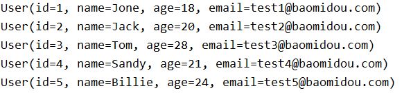

10. 总结：SQL 和对应的 Mapper 中的方法都由 MyBatis-Plus 自动帮助我们实现了

# 第三章 配置日志

> 默认情况下，我们看不见任何与数据库交互的 sql 语句，如果我们需要查看对应的 sql 语句，就必须配置日志

```properties
# 配置 Mybatis Plus 的日志(可以选择对应日志框架的实现类，但需要导入对应依赖，StdOutImpl 是自带的控制台的)
mybatis-plus.configuration.log-impl=org.apache.ibatis.logging.stdout.StdOutImpl
```

测试结果

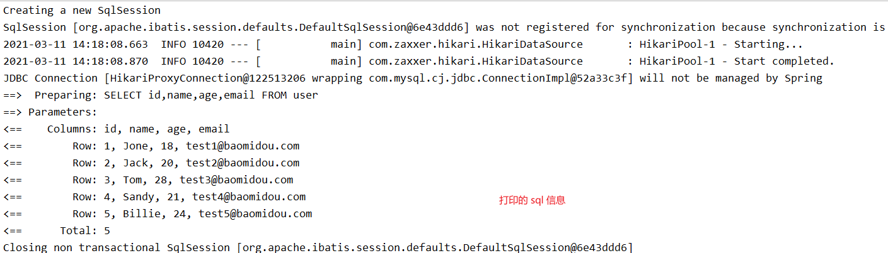

# 第四章 CRUD 扩展

## 4.1 主键生成策略

> [分布式系统唯一 ID 生成方案汇总](https://www.cnblogs.com/haoxinyue/p/5208136.html)

#### 使用基本的 insert 插入

```java
@Test
public void testInsert(){
    User user = new User();
    user.setName("巴御前");
    user.setAge(16);
    user.setEmail("918756117@qq.com");
    int result = userMapper.insert(user);
    System.out.println("返回的结果：" + result); // 返回影响的行数
    System.out.println(user);
}
```

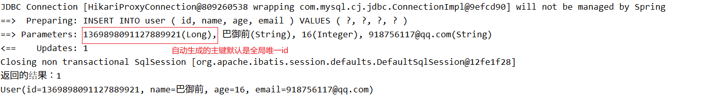

#### 全局唯一 ID

> MyBatis Plus 中不插入数据时，默认使用这个

**雪花算法：**nowflake是Twitter开源的分布式ID生成算法，结果是一个long型的ID。其**核心思想**是：使用41bit作为毫秒数，10bit作为机器的ID（5个bit是数据中心，5个bit的机器ID），12bit作为毫秒内的流水号（意味着每个节点在每毫秒可以产生 4096 个 ID），最后还有一个符号位，永远是0。

MyBatis-Plus 中的实现 - 使用注解 `@TableId(type = IdType.ASSIGN_ID)`

#### 自增 ID

配置主键自增

1. 指定对应实体类属性上的注解 `@TableId(type = IdType.AUTO)`

2. 对应的数据库字段也要添加 **自增 ID**

3. 插入数据进行测试

   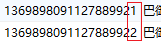

#### 手动输入 ID

1. 指定对应实体类属性上的注解 `@TableId(type = IdType.INPUT)`

2. 此时插入数据时，就必须手动指定

   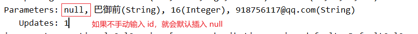

#### 其他主键策略

```java
public enum IdType {
    AUTO(0), // ID 自增
    NONE(1), // 未设置主键
    INPUT(2), // 手动输入
    ASSIGN_ID(3), // 全局唯一id
    ASSIGN_UUID(4), // 全局唯一 uuid
}
```

## 4.2 更新操作

1. 添加修改测试

   ```java
   @Test
   public void testUpdate(){
       User user = new User();
       user.setId(1L);
       user.setName("巴御前");
       user.setEmail("111222@qq.com");
       int result = userMapper.updateById(user); // 根据 ID 修改对应对象在数据库中的记录
       System.out.println("影响的行数：" + result);
   }
   ```

2. 测试结果

   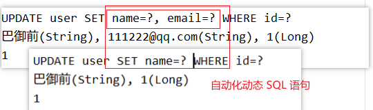

   **MyBatis-Plus** 已经帮我们实现的动态 SQL 语句拼接

## 4.3 自动填充

对于一些字段(创建时间、修改时间)，对于这些字段应该是 **自动化完成**

阿里巴巴开发手册：所有的数据库表，都应该要配置 `gmt_create(创建时间) ``gmt_modified(修改时间)` 并且实现自动化

> 方式一：数据库级别(不推荐，开发中一般不允许修改数据库)

1. 修改数据库表结构：添加 `create_time` `update_time` 字段

   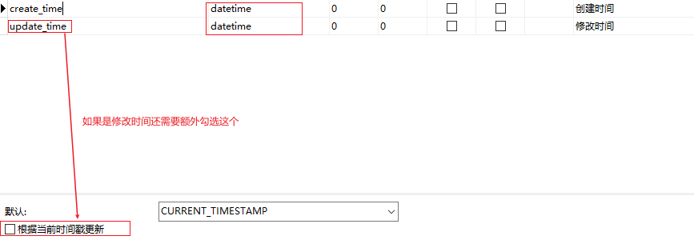

2. 修改对应的实体类，添加属性

   ```java
   private Data createTime;
   private Date updateTime;
   ```

3. 再次调用方法进行更新即可

   


> 方式二：代码级别

1. 恢复数据库设置，取消默认值和自动更新时间戳

2. 在对应实体类上使用 `@Table.Fill` 属性设置填充策略

   ```java
   /* @TableField(fill..) fill 属性设置该对象顺序的填充策略
   *   INSERT：创建时填充
   *   INSERT_UPDATE：创建 & 修改时填充
   * */
   @TableField(fill = FieldFill.INSERT)
   private Date createTime;
   @TableField(fill = FieldFill.INSERT_UPDATE)
   private Date updateTime;
   ```

   支持的填充策略

   ```java
   public enum FieldFill {
       /**
        * 默认不处理
        */
       DEFAULT,
       /**
        * 插入填充字段
        */
       INSERT,
       /**
        * 更新填充字段
        */
       UPDATE,
       /**
        * 插入和更新填充字段
        */
       INSERT_UPDATE
   }
   ```

3. 自定义一个实现 MetaObjectHandler 接口的类，完成填充策略的定义

   ```java
   package pers.dreamer07.handler;
   
   import com.baomidou.mybatisplus.core.handlers.MetaObjectHandler;
   import lombok.Data;
   import lombok.extern.slf4j.Slf4j;
   import org.apache.ibatis.reflection.MetaObject;
   import org.springframework.stereotype.Component;
   
   import java.time.LocalDateTime;
   import java.util.Date;
   
   /**
    * 自定义处理器，实现 MetaObjectHandler 接口配置填充策略
    * @program: mybatis-plus
    * @description:
    * @author: EMTKnight
    * @create: 2021-03-11
    **/
   @Component
   @Slf4j
   public class MyMetaObjectHandler implements MetaObjectHandler {
   
       /**
        * 插入时的填充策略
        * @param metaObject
        */
       @Override
       public void insertFill(MetaObject metaObject) {
           log.info("insert fill start...");
           /*
           * 方式一：
           *   setFieldValByName(String fieldName, Object fieldVal, MetaObject metaObject)：通用填充
           *       fieldName：属性名
           *       fieldVal：属性值
           *       metaObject：元数据
           * */
           //        this.setFieldValByName("createTime", new Date(), metaObject);
           //        this.setFieldValByName("updateTime", new Date(), metaObject);
   
           /*
           * 方式二：使用 3.3.0 中添加的 {@link #strictInsertFill} or {@link #strictUpdateFill}
           *   strictInsertFill(metaObject, fieldName, fieldType, fieldVal) - strictUpdateFill() 同理
           *       想根据注解 FieldFill.xxx(insert / update / insert_update) 和 字段名(fieldName) 以及 字段类型(fieldType) 来区分必须使用 父类的strictInsertFill或者strictUpdateFill方法
           * */
           this.strictInsertFill(metaObject, "createTime", Date.class, new Date());
           this.strictUpdateFill(metaObject, "updateTime", Date.class, new Date());
       }
   
       /**
        * 修改时的填充策略
        * @param metaObject
        */
       @Override
       public void updateFill(MetaObject metaObject) {
           log.info("update fill start...");
           //        this.setFieldValByName("updateTime", new Date(), metaObject);
           this.strictUpdateFill(metaObject, "updateTime", Date.class, new Date());
       }
   
   }
   ```

4. 重新调用测试方法查看数据库数据

   

## 4.4 乐观锁

> 乐观锁：无论进行任何操作，都不加锁，当错误时，再进行加锁处理
>
> 悲观锁：无论进行任何操作，都加上锁

- 实现方式

  1. 取出记录时，获取当前 version
  2. 更新时，带上这个 version
  3. 执行更新时， set version = newVersion where version = oldVersion
  4. 如果version不对，就更新失败

- 使用步骤

  1. 修改数据库，添加对应的字段 `version`

  2. 添加实体类属性和注解 `@Version`

     ```java
     @Version
     private Integer version; // 乐观锁
     ```

  3. 导入 MP 的乐观锁插件

     ```java
     @Configuration
     @MapperScan("pers.dreamer07.mapper")
     public class MyBatisPlusConfig {
     
         /**
          * 添加 MP 乐观锁插件
          * @return
          */
         @Bean
         public MybatisPlusInterceptor MybatisPlusInterceptor() {
             MybatisPlusInterceptor mybatisPlusInterceptor = new MybatisPlusInterceptor();
             mybatisPlusInterceptor.addInnerInterceptor(new OptimisticLockerInnerInterceptor());
             return mybatisPlusInterceptor;
         }
     
     }
     ```

  4. 测试代码

     ```java
   // 测试使用成功的乐观锁
     @Test
   public void testOptimisticLockerInner01(){
         //1. 查询对应的数据
       User user = userMapper.selectById(1L);
         //2. 修改部分属性
         user.setName("巴御前");
         user.setAge(16);
         //3. 修改数据库中的数据
         userMapper.updateById(user);
     }
     
     // 测试使用失败的乐观锁
     @Test
     public void testOptimisticLockerInner02(){
         // 1. (线程1)先查询一个用户
         User user = userMapper.selectById(2);
         // 2. (线程1)修改部分属性
         user.setName("A");
     
         // 3. (线程2) 再获取一次相同数据
         User user2 = userMapper.selectById(2);
         user2.setName("B");
         // 4. (线程2)修改数据库
         userMapper.updateById(user2);
     
         // 5. (线程1)再修改第一个线程的数据
         userMapper.updateById(user);
     }
     ```
  
  5. 测试
  
     (成功)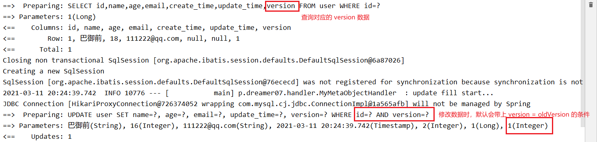
  
     (失败)
  
     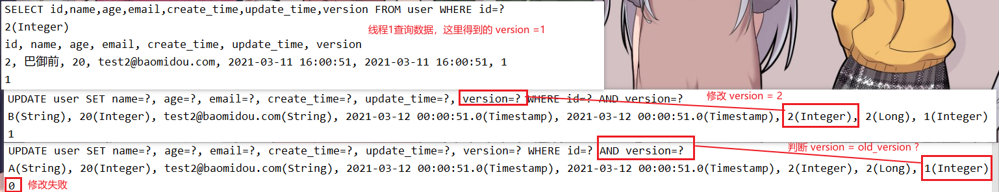
  
  6. 查看结果
  
     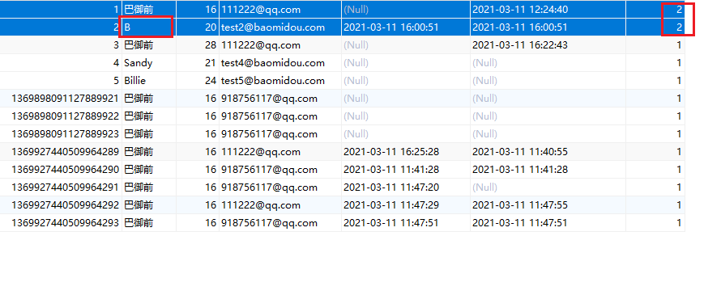

## 4.5 查询操作

> 根据主键进行批量查询

```java
/**
* 测试根据多个 id 查询多个用户
*/
@Test
public void selectByIds(){
    // 使用 selectBatchIds() 方法，该方法接受对应的主键(id)集合
    List<User> users = userMapper.selectBatchIds(Arrays.asList(1, 2, 3));
    users.forEach(System.out::println);
}
```

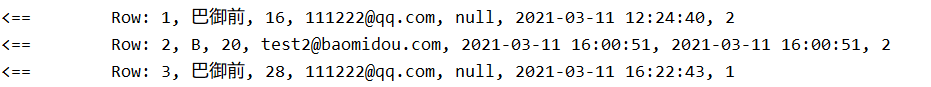

> 条件查询

```java
/**
 * 条件查询方式一：使用 map 封装对应的条件
 */
@Test
public void selectByCondition(){
    // 1. 定义存储条件的 Map，并添加对应的条件
    HashMap<String, Object> conditionMap = new HashMap<>();
    conditionMap.put("name", "巴御前");
    conditionMap.put("age", 28);

    // 2. 通过 selectByMap 查询结果 - 会自动帮我们动态拼接 sql
    List<User> users = userMapper.selectByMap(conditionMap);
    users.forEach(System.out::println);
}
```

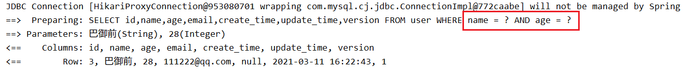

> 分页查询

添加 MP 配置

```java
/**
* 添加 MP 拦截器(插件)
* @return
*/
@Bean
public MybatisPlusInterceptor mybatisPlusInterceptor() {
    MybatisPlusInterceptor mybatisPlusInterceptor = new MybatisPlusInterceptor();
    // 乐观锁插件
    mybatisPlusInterceptor.addInnerInterceptor(new OptimisticLockerInnerInterceptor());
    // 分页插件 - 传入为 DbType(数据库类型)
    mybatisPlusInterceptor.addInnerInterceptor(new PaginationInnerInterceptor(DbType.MYSQL));
    return mybatisPlusInterceptor;
}
```

测试

```java
/**
* 测试分页查询
*/
@Test
public void testSelectByPage(){
    // 1. 创建一个 Page(分页对象): 第一个参数时当前页数，第二个参数为当前页大小
    Page<User> userPage = new Page<>(0, 3);
    // 2. 通过 selectPage 方法查询
    userMapper.selectPage(userPage, null);
    // 3. 查看分页数据
    userPage.getRecords().forEach(System.out::println);
}
```

结果

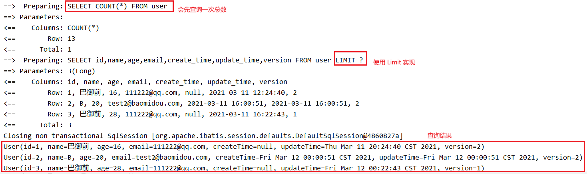

## 4.6 刪除操作

> 基本刪除

```java
/**
* 测试基本删除
*/
@Test
public void testDelete(){
    // 1. 根据 ID 删除
    userMapper.deleteById(1369898091127889921L);
    // 2. 批量删除
    userMapper.deleteBatchIds(Arrays.asList(1, 2, 4));
    // 3. 条件删除
    HashMap<String, Object> conditionMap = new HashMap<>();
    conditionMap.put("name", "a");
    userMapper.deleteByMap(conditionMap);
}
```

## 4.7 逻辑删除

> 物理刪除：删除保存在数据库中的字段
>
> 逻辑删除：将要删除的字段变成不可见的

1. 修改数据库表结构，添加 `deleted` 字段，用来做**逻辑删除的标志位**

   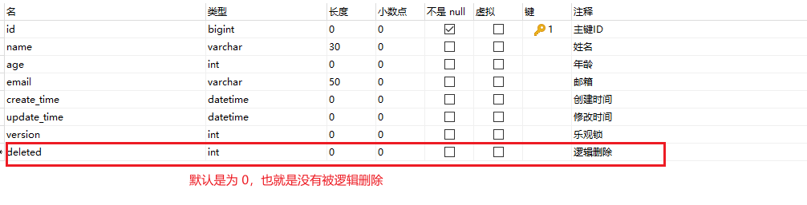

2. 添加对应的实体类属性，并添加注解 `@TableLogic`

   ```java
   @TableLogic
   private Integer deleted; // 逻辑删除标识位
   ```

3. 修改配置文件

   ```properties
   # 配置逻辑删除标识位的值：第一个是被删除的，第二个是没被删除的
   mybatis-plus.global-config.db-config.logic-delete-value=1
   mybatis-plus.global-config.db-config.logic-not-delete-value=0
   # 3.3.0 后可以指定对应实体字段名(配置后可以忽略第二步)
   mybatis-plus.global-config.db-config.logic-delete-field=deleted
   ```

4. 测试

   ```java
   @Test
   public void testDelete(){
       // 1. 根据 ID 删除
       userMapper.deleteById(1369927440509964294L);
   }
   ```

   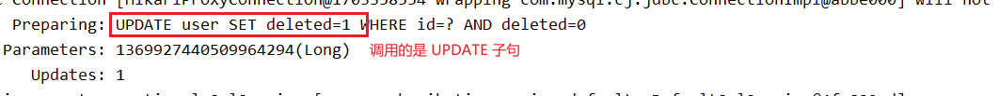

5. 查看数据库数据

   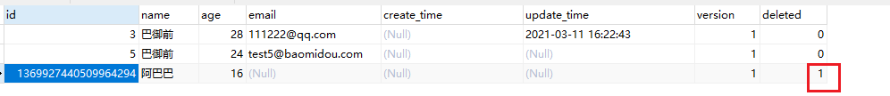

6. 查询数据

   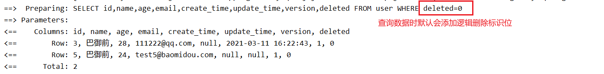

# 第五章 性能分析插件

> 作用：可以查看每条 sql 语句的执行时间，也可以每条 sql 语句执行的最大时间，如果超过了就会抛出相应的异常

1. 导入 Maven 依赖

   ```xml
   <!-- https://mvnrepository.com/artifact/p6spy/p6spy -->
   <dependency>
       <groupId>p6spy</groupId>
       <artifactId>p6spy</artifactId>
       <version>3.9.1</version>
   </dependency>
   ```

2. 修改 SpringBoot 配置文件

   ```properties
   #spring.datasource.driver-class-name=com.mysql.cj.jdbc.Driver
   #spring.datasource.url=jdbc:mysql://localhost:3306/mybatis_plus?useSSL=false&useUnicode=true&characterEncoding=utf-8&serverTimezone=UTC
   
   # 使用 p6spy 插件查看 sql 执行效率
   spring.datasource.driver-class-name=com.p6spy.engine.spy.P6SpyDriver
   spring.datasource.url=jdbc:p6spy:mysql://localhost:3306/mybatis_plus?useSSL=false&useUnicode=true&characterEncoding=utf-8&serverTimezone=UTC
   ```

3. 添加 `spy.properties` 文件

   ```properties
   #3.2.1以上使用
   modulelist=com.baomidou.mybatisplus.extension.p6spy.MybatisPlusLogFactory,com.p6spy.engine.outage.P6OutageFactory
   # 自定义日志打印
   logMessageFormat=com.baomidou.mybatisplus.extension.p6spy.P6SpyLogger
   #日志输出到控制台
   appender=com.baomidou.mybatisplus.extension.p6spy.StdoutLogger
   # 使用日志系统记录 sql
   #appender=com.p6spy.engine.spy.appender.Slf4JLogger
   # 设置 p6spy driver 代理
   deregisterdrivers=true
   # 取消JDBC URL前缀
   useprefix=true
   # 配置记录 Log 例外,可去掉的结果集有error,info,batch,debug,statement,commit,rollback,result,resultset.
   excludecategories=info,debug,result,commit,resultset
   # 日期格式
   dateformat=yyyy-MM-dd HH:mm:ss
   # 实际驱动可多个
   #driverlist=org.h2.Driver
   # 是否开启慢SQL记录
   outagedetection=true
   # 慢SQL记录标准 2 秒
   outagedetectioninterval=2
   ```

4. 调用测试方法，查看控制打印语句

   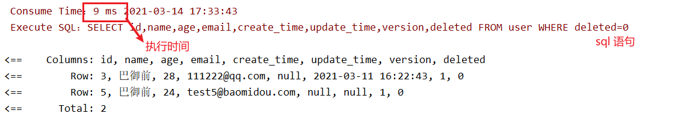

# 第六章 条件构造器

> 可以通过其来代替复杂的 sql 语句构建

- 测试一

  ```java
  /**
  * 测试 Is Not Null & gt(大于)
  */
  @Test
  public void test01(){
      // 1. 创建查询条件构造器实例： QueryWrapper<T> T 为查询的结果对应的实体类
      QueryWrapper<User> wrapper = new QueryWrapper<>();
      // 2. 通过链式调用添加查询条件
      wrapper
          .isNotNull("name")
          .isNotNull("email")
          .gt("age", 12);
      // 3. 通过 Mapper 查询时穿入 Wrapper
      userMapper.selectList(wrapper).forEach(System.out::println);
  }
  ```

  

- 测试二

  ```java
  /**
  * 测试 eq(等于)
  */
  @Test
  public void test02(){
      QueryWrapper<User> wrapper = new QueryWrapper<>();
      wrapper.eq("name", "阿巴巴巴");
      // selectOne(): 只查询一条记录，如果有多条记录就会报错
      User user = userMapper.selectOne(wrapper);
      System.out.println(user);
  }
  ```

  

- 测试三

  ```java
  /**
  * 测试 between(区间查询)
  */
  @Test
  public void test03(){
      QueryWrapper<User> wrapper = new QueryWrapper<>();
      wrapper.between("age", 20, 30);
      Integer count = userMapper.selectCount(wrapper);
      System.out.println("用户个数：" + count);
  }
  ```

  

- 测试四

  ```java
  /**
  * 测试 Like 模糊查询
  */
  @Test
  public void test04(){
      QueryWrapper<User> wrapper = new QueryWrapper<>();
      /*
      * like() 、notLike -> %m%
      * leftLike() -> %m
      * rightLike() -> m%
      * */
      wrapper
          .notLike("name", "阿")
          .likeRight("email", "test");
      // userMapper.selectMaps() 将查询的结果封装为一个 Map，该 Map 的 key 为对应的字段，value 为对应的值
      List<Map<String, Object>> mapList = userMapper.selectMaps(wrapper);
      mapList.forEach((stringObjectMap) -> {
          for (String key : stringObjectMap.keySet()) {
              System.out.println(key + ":" + stringObjectMap.get(key));
          }
      });
  }
  ```

  

- 测试五

  ```java
  /**
  * 测试 IN 子查询
  */
  @Test
  public void test05(){
      QueryWrapper<User> wrapper = new QueryWrapper<>();
      // 也可以使用普通的 in(R column, Collection<?> value) 方法传入一个数据集合
      wrapper.inSql("id", "SELECT id FROM user WHERE id > 3");
      userMapper.selectObjs(wrapper).forEach(System.out::println);
  }
  ```

  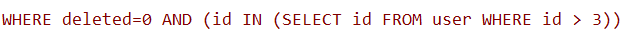

- 测试六

  ```java
  /**
  * 测试 Order 排序查询
  */
  @Test
  public void test06(){
      QueryWrapper<User> wrapper = new QueryWrapper<>();
      wrapper.orderByDesc("id");
      userMapper.selectList(wrapper).forEach(System.out::println);
  }
  ```

  

# 第七章 代码自动生成器

- 导入依赖

  ```xml
  <!-- 代码自动生成器依赖 -->
  <dependency>
      <groupId>com.baomidou</groupId>
      <artifactId>mybatis-plus-generator</artifactId>
      <version>3.4.1</version>
  </dependency>
  <!-- 导入模板引擎 -->
  <dependency>
      <groupId>org.apache.velocity</groupId>
      <artifactId>velocity-engine-core</artifactId>
      <version>2.3</version>
  </dependency>
  ```

- 

